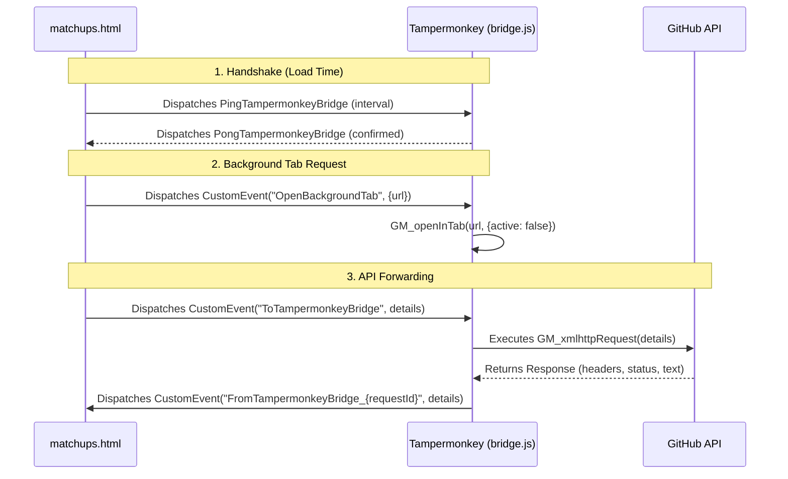

# Tampermonkey CORS & Automation Bridge

This document explains the purpose, mechanics, and installation of the Tampermonkey userscript bridge ([bridge.js](file:///c:/Users/User/Documents/VSC/LoL-retrieve/bridge.js)).

## 1. Why is the Bridge Needed?

When you double-click a local HTML file to open it in a browser, it uses the `file:///` protocol. 
Modern web browsers enforce strict security rules:
*   **Same-Origin Policy (SOP)**: A local file is considered to have a unique/null origin and cannot access resources on other domains (like `api.github.com`) using standard `fetch` or `XMLHttpRequest`.
*   **CORS Blocks**: Attempting to make direct API requests from `file:///` to GitHub will fail immediately because of CORS security checks.

To bypass these limitations without running a complex local Node.js or Python backend server, we use a Tampermonkey userscript.

---

## 2. Elevated Bridge API Features

Because the Tampermonkey userscript runs with elevated browser privileges, it can execute actions that standard sandboxed browser pages cannot:

### A. CORS-Free Network Requests (`GM_xmlhttpRequest`)
Bypasses standard CORS origin limits to allow the local HTML editor to communicate directly with GitHub's REST API and Riot's Data Dragon endpoint.

### B. Background Tab Opening (`GM_openInTab`)
Allows the editor to open links (like Mobalytics Counters) in a new browser tab **without taking active focus** away from the current page. This keeps the user focused on the editor while the matchup guide opens quietly in the background.

### C. Ping/Pong Connection Diagnostics
The editor dispatches `PingTampermonkeyBridge` events, and the bridge responds with `PongTampermonkeyBridge` to confirm it is active, avoiding silent hangs.

---

## 3. CustomEvent Communication Flow



---

## 4. Metadata Headers & Match Patterns

To make sure the script activates on local matchup files, the script is configured with matching headers:
```javascript
// @match        file:///*matchup*.html*
// @match        file:///*/matchups.html
// @match        file:///*
// @grant        GM_xmlhttpRequest
// @grant        GM_openInTab
// @connect      api.github.com
// @connect      ddragon.leagueoflegends.com
```

*   `@match`: Matches matchup HTML files (e.g. `matchups.html`) on local directories.
*   `@grant`: Configures authorization for network requests and tab controls.
*   `@connect`: Whitelists target domains to prevent repetitive browser security prompt popups.
