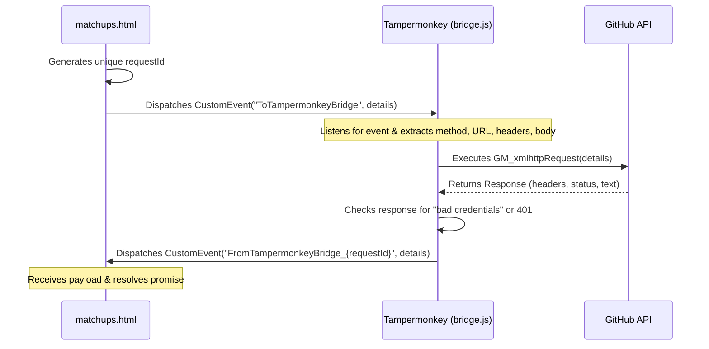

# Tampermonkey CORS Bridge

This document explains the purpose, mechanics, and installation of the Tampermonkey userscript bridge ([bridge.js](file:///c:/Users/User/Documents/VSC/LoL-retrieve/bridge.js)).

## 1. Why is the Bridge Needed?

When you double-click a local HTML file to open it in a browser, it uses the `file:///` protocol. 
Modern web browsers enforce strict security rules:
*   **Same-Origin Policy (SOP)**: A local file is considered to have a unique/null origin and cannot access resources on other domains (like `api.github.com`) using standard `fetch` or `XMLHttpRequest`.
*   **CORS Blocks**: Attempting to make direct API requests from `file:///` to GitHub will fail immediately because of CORS security checks.

To bypass these limitations without running a complex local Node.js or Python backend server, we use a Tampermonkey userscript.

## 2. How the Bridge Works

Tampermonkey scripts have elevated browser privileges. They can use a special function called `GM_xmlhttpRequest`, which is not bound by the browser's standard CORS restrictions.

Since the local HTML page itself cannot call `GM_xmlhttpRequest`, the project implements a **CustomEvent Bridge**:



### Event Mechanics

1.  **Request Initiation**: The page calls `bridgeFetch(url, options)`. It generates a random `requestId` and sets up a one-time event listener for `FromTampermonkeyBridge_${requestId}`.
2.  **Request Forwarding**: The page dispatches a `ToTampermonkeyBridge` CustomEvent containing the request parameters.
3.  **Execution**: The userscript receives the event, triggers `GM_xmlhttpRequest`, and checks if GitHub returned a "bad credentials" header (meaning the token has expired).
4.  **Response Return**: The userscript fires a return event named `FromTampermonkeyBridge_${requestId}` with the response details.
5.  **Completion**: The page captures the return event, deletes the listener, and parses the response data.

## 3. How to Install the Bridge Script

1.  Install the **Tampermonkey** extension on your preferred web browser (e.g., Firefox, Chrome).
2.  Click the Tampermonkey icon in your browser toolbar and select **Create a new script...** (or go to the Dashboard and click the `+` icon).
3.  Replace any template code with the full contents of [bridge.js](file:///c:/Users/User/Documents/VSC/LoL-retrieve/bridge.js).
4.  Save the script (`Ctrl + S` or `File` -> `Save`).

### Userscript Metadata Headers

The script is configured with matching rules:
```javascript
// @match        file:///*matchup*.html
// @grant        GM_xmlhttpRequest
// @connect      api.github.com
```
*   `@match`: Ensures the script only runs on local files whose names contain `matchup` and end with `.html` (such as [matchups.html.html](file:///c:/Users/User/Documents/VSC/LoL-retrieve/matchups.html.html)).
*   `@connect`: Whitelists `api.github.com` so the extension doesn't repeatedly ask for permission when executing requests.
