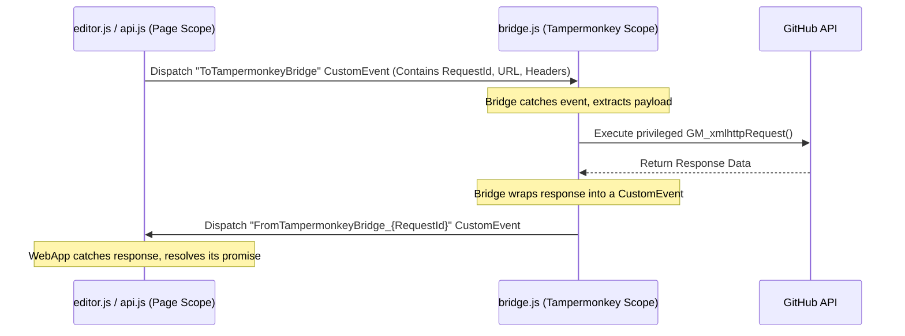

# CORS Bypassing & Browser Extension Bridges

When developing web applications loaded directly from a local drive (the `file:///` protocol), standard browser APIs block outbound requests to remote web APIs (like GitHub) due to security policies. 

This guide explains how this restriction operates and how our **Tampermonkey CORS Bridge** resolves it.

---

## 1. The Core Problem: Same-Origin Policy & CORS

### Same-Origin Policy (SOP)
The browser's **Same-Origin Policy** prevents a script loaded on one origin (e.g., `https://myportal.com`) from reading or writing resources on another origin (e.g., `https://api.github.com`). An origin is defined by:
1.  **Protocol** (e.g., `https` vs `http`)
2.  **Domain** (e.g., `api.github.com`)
3.  **Port** (e.g., `443` or `8080`)

### CORS (Cross-Origin Resource Sharing)
CORS is a mechanism that allows servers to whitelist specific origins using headers:
```http
Access-Control-Allow-Origin: https://myportal.com
```
If the server does not return this header, the browser blocks the script from reading the response.

### The `file:///` Restriction
When you double-click `matchups.html` on your desktop, its origin is `null` or `file:///`. Because local file paths are sandboxed:
*   Standard browsers automatically **block** outbound `fetch()` or `XMLHttpRequest` requests to external APIs like GitHub.
*   The remote server cannot whitelist a local path, and the browser treats `file:///` as an untrusted origin.

---

## 2. The Solution: Extension-Level Privileges

Web browser extensions (like Tampermonkey) are not bound by the same-origin policy as standard web pages. They run inside a privileged sandbox with user-approved permissions.

Tampermonkey exposes special scripting functions called **GM (Greasemonkey) APIs**. One such function is `GM_xmlhttpRequest`.

### Why `GM_xmlhttpRequest` Bypasses CORS:
*   Standard `fetch` is executed in the page's sandbox, subject to standard CORS blocks.
*   `GM_xmlhttpRequest` runs outside the page sandbox directly inside the browser extension framework.
*   It performs the network request directly from the browser's background thread, bypassing the page-level origin restrictions.

---

## 3. The CustomEvent Bridge Architecture

Because `matchups.html` runs in the page scope, it has no direct access to the `GM_xmlhttpRequest` object. To link them, we build a communication bridge using **Custom Events**.

Here is the exact message loop:



### The Code Breakdown:

#### 1. In `api.js` (Page Scope):
We generate a unique `requestId` to pair each request with its corresponding asynchronous response. We then listen to `FromTampermonkeyBridge_{requestId}` and dispatch the request data:
```javascript
const requestId = Math.random().toString(36).substr(2, 9);

window.addEventListener(`FromTampermonkeyBridge_${requestId}`, (event) => {
    console.log("Received data back:", event.detail.responseText);
}, { once: true });

window.dispatchEvent(new CustomEvent("ToTampermonkeyBridge", {
    detail: { requestId, url: "https://api.github.com/...", method: "GET" }
}));
```

#### 2. In `bridge.js` (Extension Scope):
The userscript listens to `ToTampermonkeyBridge`, performs the fetch, and dispatches the payload back to the page:
```javascript
window.addEventListener("ToTampermonkeyBridge", function(event) {
    const { requestId, url, method } = event.detail;
    
    GM_xmlhttpRequest({
        method: method,
        url: url,
        onload: function(response) {
            window.dispatchEvent(new CustomEvent(`FromTampermonkeyBridge_${requestId}`, {
                detail: { responseText: response.responseText, status: response.status }
            }));
        }
    });
});
```

---

## 4. Diagnostics & Troubleshooting
If you open the portal and see the **Tampermonkey Bridge Inactive** banner:
1.  **Tampermonkey Active**: Verify Tampermonkey is running in your extension bar.
2.  **Allow Access to File URLs**: Chrome/Edge sandbox local file execution by default. You must open extension settings, click **Details** on Tampermonkey, and toggle **"Allow access to file URLs"** to `ON`.
3.  **Matches**: Ensure that the `@match` headers in `bridge.js` match the exact URL path of your local file.
