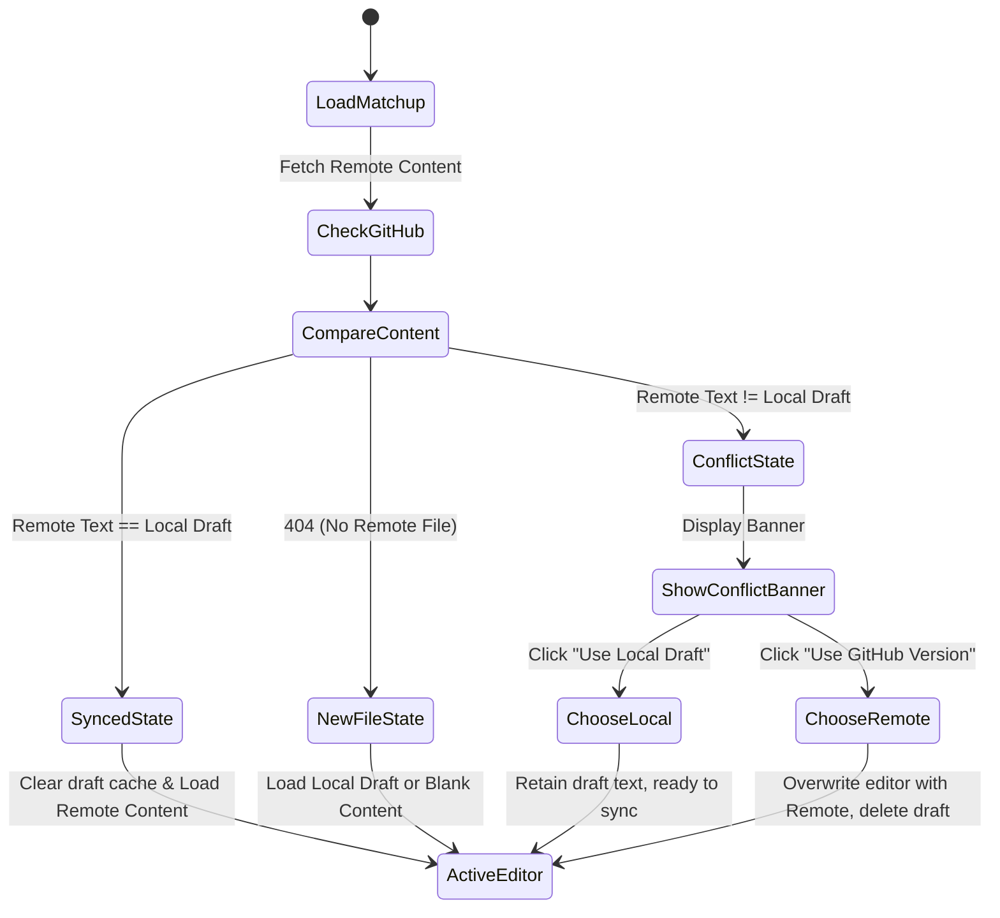

# Local Storage Draft Persistence & Conflict Resolution

To prevent losing note changes due to unexpected browser crashes or page reloads, this editor implements a local-first **autosave cache**. This guide explains how local cache works, how drafts are displayed, and how we handle local vs. remote version conflicts.

---

## 1. Local Storage Basics

### Web Storage API
`localStorage` is a built-in browser storage mechanism that allows web pages to store key-value string pairs. Data stored in `localStorage` has no expiration date; it remains in the browser even after the user closes the tab or restarts the computer.

*   **String Only**: Only strings can be stored. Objects or arrays must be serialized to strings using `JSON.stringify(obj)` and parsed back using `JSON.parse(str)`.
*   **Key Namespacing**: To avoid naming conflicts with other pages running on the same domain, keys are prefixed with a unique identifier: `draft_matchup:{EnemyChamp}/{MyChamp}`.

---

## 2. Instant Autosave Workflow

Whenever a user selects a matchup and types inside the text area, we capture the edits instantly.

```javascript
document.getElementById('editor').addEventListener('input', () => {
    const enemyKey = getChampionKeyByName(enemyChamp.value);
    const myKey = getChampionKeyByName(myChamp.value);
    const draftKey = `draft_matchup:${enemyKey}/${myKey}`;
    
    // Writes to local storage on every keypress
    localStorage.setItem(draftKey, editorEl.value);
    
    // Refresh sidebar drafts panel
    renderLocalDrafts();
});
```

### Key Advantages of this Approach:
1.  **Zero-latency**: Writing to local storage takes less than 1ms. The editor remains responsive.
2.  **No network delays**: Saving doesn't rely on network speeds or API quotas.
3.  **Automatic recovery**: If the user closes the window, reloading the champion combination instantly loads the unsaved text.

---

## 3. Sidebar Draft Indexing

To display all pending drafts in the sidebar, we iterate over the entire local storage catalog:

```javascript
function getLocalDrafts() {
    const drafts = [];
    for (let i = 0; i < localStorage.length; i++) {
        const key = localStorage.key(i);
        if (key.startsWith('draft_matchup:')) {
            const path = key.replace('draft_matchup:', ''); // e.g. Ahri/Yasuo
            const parts = path.split('/');
            drafts.push({ enemy: parts[0], mySide: parts[1], path: path });
        }
    }
    return drafts;
}
```

---

## 4. Conflict Resolution States

Because files can be edited and synchronized across multiple devices, we may encounter a scenario where the local draft cache differs from the version stored in the remote GitHub repository.

We model this state logic on the page load event:



### Conflict Resolution Action Triggers:

#### Option A: "Use Local Draft"
If the user prefers their offline edits:
1.  We keep the editor text as it is.
2.  We hide the conflict warning.
3.  The user continues editing and can press **Sync to GitHub** to overwrite the remote file with their local copy (must provide the latest SHA).

#### Option B: "Use GitHub Version"
If the user wants to discard local changes and fetch the remote contents:
1.  We replace the editor textarea content with the fetched remote text cache.
2.  We delete the `localStorage` key.
3.  We refresh the drafts list and hide the conflict banner.
